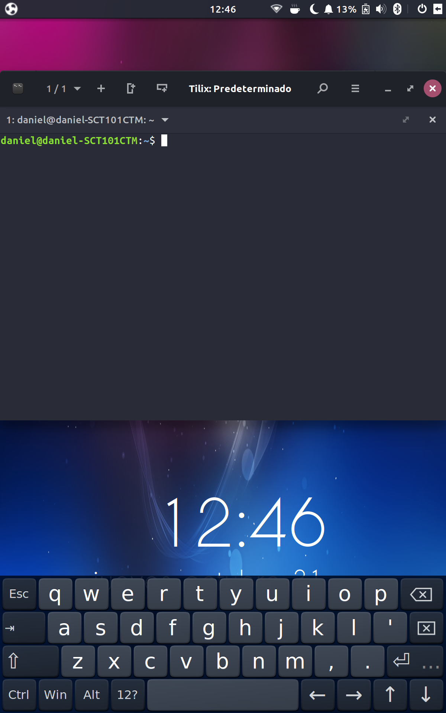
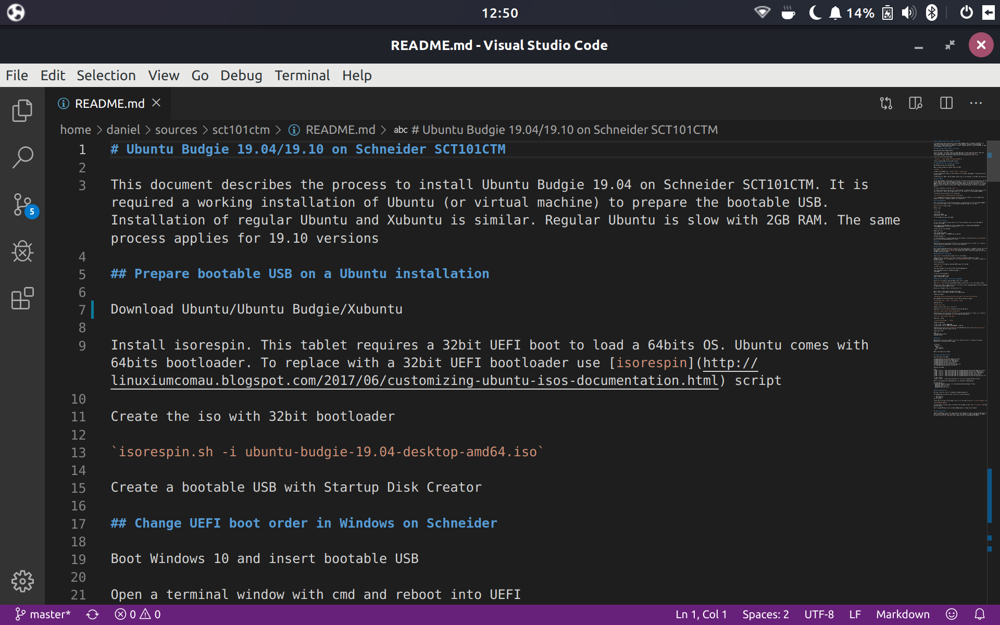

# Ubuntu 18.04+ on Schneider SCT101CTM

This document describes the process to install any Ubuntu flavour 18.04 or higher on Schneider SCT101CTM. It is required a working Linux (or virtual machine) to prepare the bootable USB. It is recommended to install Xubuntu or Lubuntu for best performance

- Wifi, bluetooth, audio and interfaces works out of the box
- Touchscreen and accelerometer has to be fixed as described below
- Cameras don't work due to atomisp driver. See [bug](https://bugzilla.kernel.org/show_bug.cgi?id=109821)

## Screenshots (Ubuntu Budgie)

<p align="center"></p> 
<p align="center"></p>
<p align="center"></p>
<p align="center"></p>
<p align="center"></p>
<p align="center"></p>


## Prepare a bootable USB

Download your Ubuntu preferred flavour

The tablet has with a 32bit UEFI, but Ubuntu comes with 64bit bootloader. To replace with a 32bit UEFI bootloader you can use [isorespin](http://linuxiumcomau.blogspot.com/2017/06/customizing-ubuntu-isos-documentation.html)

`isorespin.sh -i xubuntu-19.10-desktop-amd64.iso`

Create a bootable USB with Startup Disk Creator

Alternatively you can prepare a bootable usb with [Arch](https://wiki.archlinux.org/index.php/ASUS_x205ta#Proper_way_of_generating_a_bootia32.efi_with_grub.cfg_included) and build the system from scratch

## Change UEFI boot order in Windows

Boot Windows 10 and insert bootable USB

Open a terminal window with cmd and reboot into UEFI

`shutdown /r /fw`

In Ubuntu from command line: `systemctl reboot --firmware-setup`

Or press *Shift* on boot to open grub menu and from grub menu select *System Setup*

In UEFI menu go to *Boot* tab and change the boot order or override boot to the USB, then Save & exit

## Install Ubuntu

The default x86 graphics driver, *fbdev*, has the screen rotated 180º respect to the mouse. To fix this for the installation, do from a terminal window (*Ctrl+Alt+T*)
```
xrandr --output DSI-1 --transform -1,0,1920,0,-1,1200,0,0,1
xrandr -o 1
```
For network connection you can use wifi or usb tethering

It is recommended the installation over the entire eMMC. 32GB is barely enough for dual boot

## Fix inverted pointer/screen

Create */etc/X11/xorg.conf.d/20-monitor.conf* to force the intel driver 
```
Section "Device"
	Identifier   "Card0"
	Driver      "intel"
	BusID       "PCI:0:2:0"
EndSection
```
## Fix sensor orientation

To fix accelerometer orientation create a udev rule */etc/udev/hwdb.d/61-sensor-local.hwdb*
```
sensor:modalias:acpi:BOSC0200*:dmi:bvnAmericanMegatrendsInc.:bvrSCH12i.WJ210Z.KtBJRCA03*
 ACCEL_MOUNT_MATRIX=-1, 0, 0; 0, 1, 0; 0, 0, 1
```
(second line has to be indented)

Update udev rules:
```
sudo systemd-hwdb update
sudo udevadm trigger -v -p DEVNAME=/dev/iio:device0
```
Shutdown and power on

Install Screentotator

## SD card

Some SD cards are not initialized. If SD card is not initialized with error *mmc2: error -84 whilst initialising SD card* apply patch to kernel as described below

## Touchscreen driver

For the touchscreen it is needed to install the driver and firmware. Thanks to [gsl-firmware](https://github.com/onitake/gsl-firmware) I've ported the firmware to linux. Use files in [touchscreen](touchscreen) folder. There are two open source drivers: gslx680_ts_acpi and silead_ts

### gslx680_ts_acpi (the easy way)

Copy [silead_ts.fw](touchscreen/silead_ts.fw) to /lib/firmware

Compile the driver [gslx680_ts_acpi](https://github.com/onitake/gslx680-acpi) to obtain gslx680_ts_acpi.ko. Test the module with `sudo insmod gslx680_ts_acpi.ko`. You need to recompile for different kernels

To do this permanent:

Create the file */etc/modules-load.d/gslx680_ts_acpi.conf* and add:

`gslx680_ts_acpi`

Then copy the module to the system folder and build dependencies:
```
sudo cp gslx680_ts_acpi.ko /lib/modules/$(uname -r)/
sudo depmod
```
To test the installed module:
```
sudo modprobe gslx680_ts_acpi
lsmod | grep gslx680_ts_acpi
```
### Kernel driver silead_ts (the hard way recommended)

Delete file */etc/modules-load.d/gslx680_ts_acpi.conf* if created

Copy [kernel firmware](touchscreen/gsl1680-schneider-sct101ctm.fw) to */usr/lib/firmware/silead/*

General instructions to compile the kernel [here](https://kernel-team.pages.debian.net/kernel-handbook/ch-common-tasks.html#s-common-official)

Add sources. Uncomment lines in /etc/apt/sources.list

```
deb-src http://archive.ubuntu.com/ubuntu disco main
deb-src http://archive.ubuntu.com/ubuntu disco-updates main
```
Prepare environment

`sudo apt-get install build-essential devscripts equivs libncurses5 libncurses5-dev`

Build dependencies with mk-build-deps so later they can be easily removed

`mk-build-deps linux --install --root-cmd sudo --remove`

Download sources

`apt-get source linux`

Change to sources folder (e.g.: linux-5.3.0)

Apply patch [touchscreen_dmi.patch](patches/touchscreen_dmi.patch)

`patch -p1 < <path to patch>/touchscreen_dmi.patch`

Some SD cards are not initialized. If SD card is not initialized with error *mmc2: error -84 whilst initialising SD card* apply patch [sdhci.patch](patches/sdhci.patch)

`patch -p1 < <path to patch>/sdhci.patch`

Copy kernel .config

`cp /boot/config-$(uname -r) .config`

Change config options
```
scripts/config --disable DEBUG_INFO
scripts/config --set-str CONFIG_LOCALVERSION "-sct101ctm"
```
(Optionally you can do `make localmodconfig` and add additional drivers with `make menuconfig` to reduce building time and increase free ram)

Compile and install
```
make -j 4
sudo make modules_install
sudo make install
```

## Bluetooth

If bluetooth doesn't work after suspend, create a script */usr/lib/pm-utils/sleep.d/99bluetooth* that is executed after suspend:

```
 #!/bin/sh
 case "$1" in
  resume)
   rfkill block 2
   rfkill unblock 2
 esac
```
Make it executable with *chmod*


## Other tweaks and fixes

Wifi won't work after restart. Instead do a shutdown and power on

The keyboard does not have all keys. Shortcuts for some missing keys:

<   Shift+AltGr+Z  
\>  Shift+AltGr+X  
Esc Ctrl+AltGr+  

Touchscreen scrolling in Firefox doesn't work. To fix this add to the file `/etc/security/pam_env.conf`

`MOZ_USE_XINPUT2 DEFAULT=1`

Install Onboard keyboard and activate it in Lightdm and screensaver

Compile and install [screenrotator](https://github.com/GuLinux/ScreenRotator) and [unclutter](https://github.com/Airblader/unclutter-xfixes)
